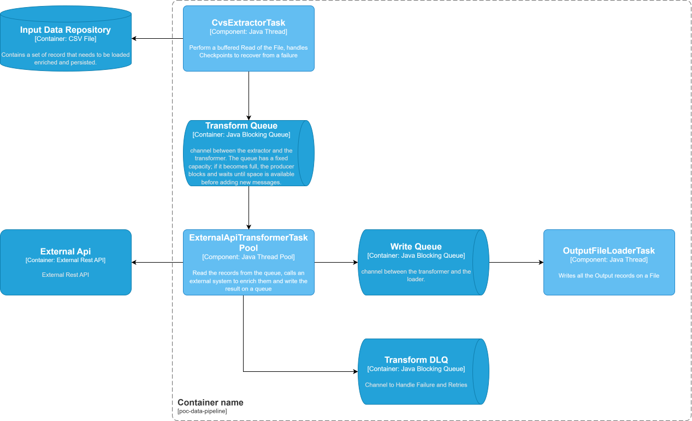

# POC Data Pipeline - Rate Limiting Strategies

## Overview

A Java application for educational purposes. This proof of concept (POC) demonstrates the effectiveness of various strategies for handling rate limiting when interacting with an external API. It has been developed in Java using the `java.util.concurrent` library, allowing the focus to remain exclusively on the application layer responsible for managing rate limiting.

Spring is not used, although Dependency Injection has been implemented and is managed manually within the `Main` class. This approach enables the use of interface-based components that remain abstract and decoupled from their concrete implementations.

## Features

- Multiple rate limiting strategies:
  - **Linear Rate Limiter**: ensures a constant number of requests at regular intervals within each second
  - **Bucket Rate Limiter**: allows short bursts (spikes) within a second while never exceeding the defined per-second cap
- Concurrent request handling
- Clear separation between interfaces and implementations
- Manually managed Dependency Injection
- Lightweight design without external frameworks
- **Checkpoint Manager**: enables saving progress and resuming execution after interruption

## Out of Scope (for time constraints)

- Retry mechanism with exponential backoff
- Circuit breaker for external API calls
- Idempotency handling
- Message ordering guarantees

## Requirements

- Java 11+ (if running locally)
- Docker (for containerized execution)

## Running with Docker

Build the Docker image:
```bash
docker build -t poc-pipeline .
docker run --rm \
  -v $(pwd)/input.csv:/poc-data-pipeline/input.csv \
  -v $(pwd)/output.csv:/poc-data-pipeline/output.csv \
  poc-pipeline
```

## Architecture

